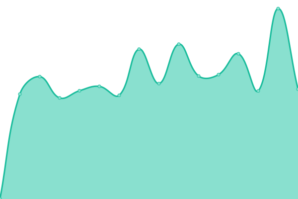
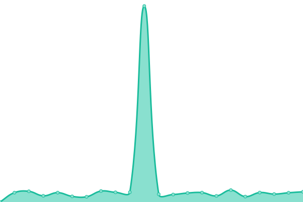
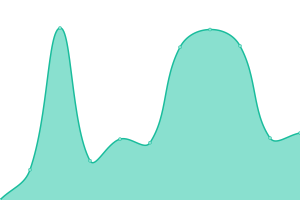
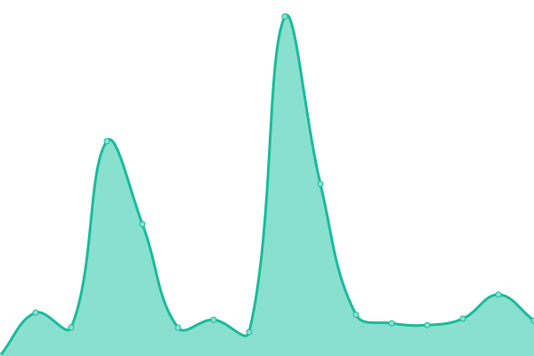
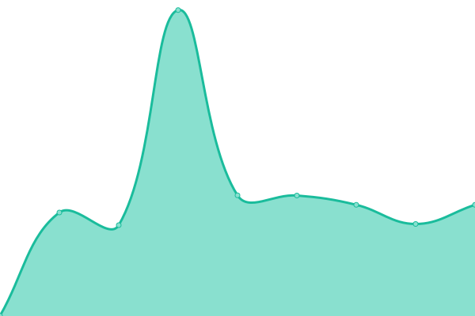

# [📈 Live Status](https://status.mha.fi): <!--live status--> **🟧 Partial outage**

This repository contains the open-source uptime monitor and status page for [Mico](https://mha.fi), powered by [Upptime](https://github.com/upptime/upptime).

With [Upptime](https://upptime.js.org), you can get your own unlimited and free uptime monitor and status page, powered entirely by a GitHub repository. We use [Issues](https://github.com/datanomi/mha.fi-statuspage/issues) as incident reports, [Actions](https://github.com/datanomi/mha.fi-statuspage/actions) as uptime monitors, and [Pages](https://status.mha.fi) for the status page.

<!--start: status pages-->
<!-- This summary is generated by Upptime (https://github.com/upptime/upptime) -->
<!-- Do not edit this manually, your changes will be overwritten -->
<!-- prettier-ignore -->
| URL | Status | History | Response Time | Uptime |
| --- | ------ | ------- | ------------- | ------ |
|  [Homepage](https://mha.fi) | 🟩 Up | [homepage.yml](https://github.com/datanomi/mha.fi-statuspage/commits/HEAD/history/homepage.yml) | 

 627ms
     
 | 

<a href="https://status.mha.fi/history/homepage">100.00%</a>
    

|  [Mail Server](https://hautaluoma.eu) | 🟩 Up | [mail-server.yml](https://github.com/datanomi/mha.fi-statuspage/commits/HEAD/history/mail-server.yml) | 

 747ms
     
 | 

<a href="https://status.mha.fi/history/mail-server">100.00%</a>
    

|  [SearX](https://searx.mha.fi) | 🟩 Up | [sear-x.yml](https://github.com/datanomi/mha.fi-statuspage/commits/HEAD/history/sear-x.yml) | 

 428ms
     
 | 

<a href="https://status.mha.fi/history/sear-x">100.00%</a>
    

|  [Invidious](https://tube.mha.fi) | 🟩 Up | [invidious.yml](https://github.com/datanomi/mha.fi-statuspage/commits/HEAD/history/invidious.yml) | 

 1249ms
     
 | 

<a href="https://status.mha.fi/history/invidious">99.83%</a>
    

|  [Teddit](https://teddit.mha.fi) | 🟩 Up | [teddit.yml](https://github.com/datanomi/mha.fi-statuspage/commits/HEAD/history/teddit.yml) | 

 3930ms
     
 | 

<a href="https://status.mha.fi/history/teddit">99.50%</a>
    

|  [Nitter](https://nitter.it) | 🟥 Down | [nitter.yml](https://github.com/datanomi/mha.fi-statuspage/commits/HEAD/history/nitter.yml) | 

 521ms
     
 | 

<a href="https://status.mha.fi/history/nitter">98.94%</a>
    

|  [Bin](https://bin.mha.fi) | 🟩 Up | [bin.yml](https://github.com/datanomi/mha.fi-statuspage/commits/HEAD/history/bin.yml) | 

 1077ms
     
 | 

<a href="https://status.mha.fi/history/bin">99.84%</a>
    

|  [Link Shortener](https://7m.ee) | 🟩 Up | [link-shortener.yml](https://github.com/datanomi/mha.fi-statuspage/commits/HEAD/history/link-shortener.yml) | 

 1373ms
     
 | 

<a href="https://status.mha.fi/history/link-shortener">99.84%</a>
    

|  [Bibliogram](https://gram.mha.fi) | 🟩 Up | [bibliogram.yml](https://github.com/datanomi/mha.fi-statuspage/commits/HEAD/history/bibliogram.yml) | 

 1180ms
     
 | 

<a href="https://status.mha.fi/history/bibliogram">99.44%</a>
    

<!--end: status pages-->

[**Visit our status website →**](https://status.mha.fi)

## 📄 License

- Powered by: [Upptime](https://github.com/upptime/upptime)
- Code: [MIT](./LICENSE) © [Mico](https://mha.fi)
- Data in the `./history` directory: [Open Database License](https://opendatacommons.org/licenses/odbl/1-0/)
